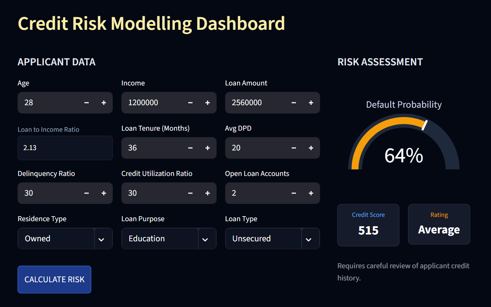

# Credit Risk Modelling Dashboard

[](https://credit-default-risk.streamlit.app/)

A compact, modern, machine-learning–driven dashboard that predicts **default probability**, **credit score**, and **risk rating** using key financial and behavioral inputs.

Built with a clean dark UI, finance-style visualization, and a compact layout for quick credit assessment.

---

## 📸 UI Screenshot


---

## ✨ Features

- Compact & professional **dashboard layout**
- **Instant ML predictions**: Default Probability, Credit Score, Rating  
- Smart and structured input fields  
- Plotly **gauge chart** for risk visualization  
- Auto-calculated **Loan-to-Income Ratio**  
- Lightweight, fast, and responsive  

---

## 🧠 Machine Learning Overview

This project uses a trained ML model (`model_data.joblib`) to compute:

- Default Probability  
- Credit Score  
- Risk Rating  

`prediction_helper.py` handles:

- Input preprocessing  
- Feature scaling  
- Model inference  

The model incorporates:

- Behavioral metrics (DPD, utilization, delinquency)
- Loan characteristics
- Borrower demographics  

---

## 📁 Folder Structure

```
credit-risk-modelling/
│
├── main.py
├── prediction_helper.py
├── requirements.txt
├── README.md
│
├── artifacts/
│   └── model_data.joblib
│
└── ui_screenshot.png
```

---

## 🔧 Installation & Running Locally

### 1️⃣ Clone the repository
```bash
git clone https://github.com/<your-username>/<repo-name>.git
cd <repo-name>
```

### 2️⃣ Install dependencies
```bash
pip install -r requirements.txt
```

### 3️⃣ Run the dashboard
```bash
streamlit run main.py
```

---

## 🧩 Tech Stack

- Python  
- Streamlit  
- Plotly  
- Pandas  
- Joblib  

---

## 📜 Notes

The training notebook & raw datasets are **not required** to run this application.  
If you need them for academic or review purposes, contact me.

---

## 📜 License

This project is licensed for educational and demonstration use.
Commercial use requires permission.

---

## ⭐ Support

If this project helped you, consider **starring** the repository ⭐
